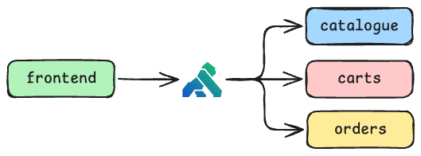

# ec-kong: Microservices EC Site Sample

This is a sample e-commerce site built with a microservices architecture, inspired by the famous "Sock Shop" demo application. It is designed to be deployed on Kubernetes and is intended for use in service mesh demonstrations.

## Architecture



The application is composed of the following microservices:

- **front-end**: A React-based user interface.
- **catalogue**: Manages product information (Node.js/Express).
- **carts**: Manages shopping cart data (Node.js/Express).
- **orders**: Manages order processing (Node.js/Express).

### Intentional Failure for Service Mesh Demos

For the purpose of demonstrating service mesh capabilities like retries and circuit breakers, the **orders** service has been intentionally designed to fail. It will return a `500 Internal Server Error` approximately 50% of the time when an order is placed.

## How to Use

### Running Locally with Docker Compose

You can run the entire application locally using Docker Compose.

1. **Build and start all services:**

   ```bash
   docker compose up --build
   ```

2. **Access the application:**
   Open your web browser and navigate to `http://localhost:3000`.

   You will notice that sometimes the product list fails to load. This is the intended behavior of the `catalogue` service.

3. **Stop the services:**

```bash
docker compose down
```

### Deploying to Kubernetes

The necessary manifest files to deploy the application to a Kubernetes cluster are located in the `/kubernetes` directory.

1. **Build and push container images:**

   Before deploying, you need to build the container image for each service and push it to a container registry that your Kubernetes cluster can access.

For each service directory (`/catalogue`, `/carts`, etc.):

```bash
# Example for the catalogue service
docker image build -t your-registry/catalogue:latest .
docker image push your-registry/catalogue:latest
```

_Remember to update the `image` field in the corresponding Kubernetes deployment files (`/kubernetes/_-deployment.yaml`) to point to your registry.\*

2. **Apply the Kubernetes manifests:**
   Once the images are available in your registry, apply all the manifest files:

```bash
kubectl apply -f ./kubernetes/
```

3. **Access the application:**
   Check the external IP address assigned to the `front-end` service:

```bash
kubectl get svc front-end
```

Access the application using the `EXTERNAL-IP` provided.
